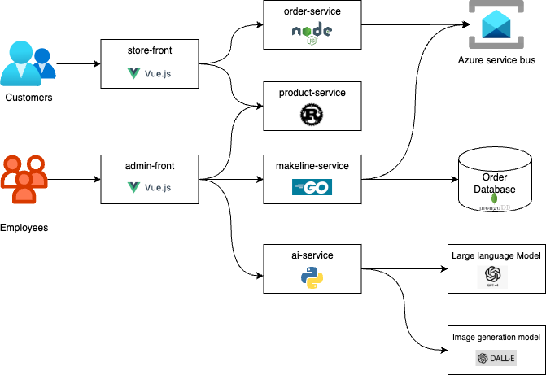

# BestBuy-on-Steroids

A cloud-native e-commerce demo app for Best Buy, powered by microservices, Kubernetes, AI, and Azure services.

---

## Table of Contents

- [BestBuy-on-Steroids](#bestbuy-on-steroids)
  - [Table of Contents](#table-of-contents)
  - [Overview](#overview)
  - [Application Architecture](#application-architecture)
  - [Service Descriptions](#service-descriptions)
  - [Technology Stack](#technology-stack)
  - [Deployment Guide](#deployment-guide)
  - [Microservice Repositories](#microservice-repositories)
  - [Docker Images](#docker-images)
  - [Demo Video](#demo-video)
  - [Known Issues or Limitations](#known-issues-or-limitations)
  - [Resources](#resources)
---

## Overview

BestBuy-on-Steroids is a cloud-native microservices-based e-commerce application built to simulate Best Buy’s online store. It features AI-generated product descriptions and images, asynchronous order processing using Azure Service Bus, and full deployment in a Kubernetes environment.

---

## Application Architecture



The architecture is inspired by the "Algonquin Pet Store (On Steroids)" and extended with AI capabilities and a managed message queue. Each component is containerized and deployed to a Kubernetes cluster.

---

## Service Descriptions

| Service              | Description                                                          |
| -------------------- | -------------------------------------------------------------------- |
| **Store-Front**      | Customer-facing UI for browsing products and placing orders          |
| **Store-Admin**      | Admin dashboard for managing products and reviewing order status     |
| **Product-Service**  | Handles CRUD operations for product data, stores in Memory           |
| **Order-Service**    | Receives and processes orders, sends them to Azure Service Bus queue |
| **Makeline-Service** | Listens to queue and completes order fulfillment                     |
| **AI-Service**       | Uses GPT-4 and DALL·E to generate product descriptions and images    |
| **MongoDB**          | Stores order and product data using Kubernetes StatefulSet           |

---

## Technology Stack

- **Frontend**: Vue.js
- **Backend**: Node.js / Rust / Go / Python
- **Messaging**: Azure Service Bus
- **AI Integration**: OpenAI (GPT-4 + DALL·E)
- **Database**: MongoDB
- **Containerization**: Docker
- **Orchestration**: Kubernetes (AKS)
- **Secrets & Configs**: Kubernetes Secrets / ConfigMaps

---

## Deployment Guide

1. **Clone this repository**
   ```bash
   git clone https://github.com/RyanRen2023/bestbuy-on-steroids.git
   cd bestbuy-on-steroids
   ```

2. **Configure OpenAI on Azure**
   - Set up an OpenAI resource in Azure.
   - Deploy the GPT-4 and DALL·E models using Azure OpenAI Studio.
   - Retrieve your API key from the Azure Portal.

3. **Set up Azure Service Bus**
   - Create a Service Bus namespace and queue:
     ```bash
     az servicebus namespace create --name bestbuy-ns --resource-group myResourceGroup --location eastus
     az servicebus queue create --name orders --namespace-name bestbuy-ns --resource-group myResourceGroup
     ```
   - Copy the connection string from the Azure portal.

4. **Configure Kubernetes Secrets**
   - Edit `k8s/secrets.yaml` and insert your actual keys:
     ```yaml
     apiVersion: v1
     kind: Secret
     metadata:
       name: openai-secret
     type: Opaque
     data:
       API_KEY: <base64-encoded-openai-key>
     
   - Use `echo -n 'your-key' | base64` to encode the values.

5. **Configure service bus**
   - Edit `k8s/aps-all-in-one.yaml` Deployment for Order Service
     ```yaml

         env: # Environment variables for configuration
            - name: USE_WORKLOAD_IDENTITY_AUTH
              value: "true"
            - name: ORDER_QUEUE_HOSTNAME
              value: "ryanfinal.servicebus.windows.net" # Replace with your Service Bus namespace
            - name: ORDER_QUEUE_NAME
              value: "orders"  # Replace with your actual queue name

     ```
   - Edit `k8s/aps-all-in-one.yaml` Deployment for Makeline Service
     ```yaml

         env: # Environment variables for configuration
            - name: USE_WORKLOAD_IDENTITY_AUTH
              value: "true"
            - name: ORDER_QUEUE_HOSTNAME
              value: "ryanfinal.servicebus.windows.net" # Replace with your Service Bus namespace
            - name: ORDER_QUEUE_NAME
              value: "orders"  # Replace with your actual queue name

     ```

6. **Deploy using the all-in-one manifest**
   ```bash
   kubectl apply -f k8s/secrets.yaml
   kubectl apply -f k8s/aps-all-in-one.yaml
   ```

7. **Access the application frontend**
   - If using **NodePort**: Open `http://<node-ip>:<nodeport>`
   - If using **Ingress**: Make sure the Ingress controller is installed and properly configured.

---

## Microservice Repositories

| Service          | GitHub Repository                                     |
| ---------------- | ----------------------------------------------------- |
| Store-Front      | https://github.com/RyanRen2023/store-front-final      |
| Store-Admin      | https://github.com/RyanRen2023/store-admin-final      |
| Product-Service  | https://github.com/RyanRen2023/product-service-final  |
| Order-Service    | https://github.com/RyanRen2023/order-service-final    |
| Makeline-Service | https://github.com/RyanRen2023/makeline-service-final |
| AI-Service       | https://github.com/RyanRen2023/ai-service-final       |


---

## Docker Images

| Service          | Docker Image Link                                        |
| ---------------- | -------------------------------------------------------- |
| Store-Front      | https://hub.docker.com/r/xihairen/store-front-final      |
| Store-Admin      | https://hub.docker.com/r/xihairen/store-admin-final      |
| Product-Service  | https://hub.docker.com/r/xihairen/product-service-final  |
| Order-Service    | https://hub.docker.com/r/xihairen/order-service-final    |
| Makeline-Service | https://hub.docker.com/r/xihairen/makeline-service-final |
| AI-Service       | https://hub.docker.com/r/xihairen/ai-service-final       |

---

## Demo Video

Watch a demo of the deployed application:

[Click here to watch the demo video](https://youtu.be/8mqyTaKnJqc)

---

## Known Issues or Limitations

- When using Azure Service Bus with Workload Identity, ensure that the AKS agent pool has the correct role assignment (e.g., "Owner" or "Azure Service Bus Data Sender") for the namespace; otherwise, message sending will fail.
- The Store-Admin occasionally fails to retrieve order data. This issue is intermittent and appears to be related to the Makeline service. Further investigation into the Makeline service logic is needed to resolve it.
- If a product contains special characters such as double quotes (`"`) (e.g., representing size like 15"), it may cause message serialization errors when sending to Azure Service Bus. Ensure proper escaping or encoding is applied before sending.
---

## Resources

- [Algonquin Pet Store (On Steroids)](https://github.com/ramymohamed10/algonquin-pet-store-on-steroids)
- [CST8915 Lab6](https://github.com/ramymohamed10/Lab6_25W_CST8915)
- [CST8915 Lab9](https://github.com/ramymohamed10/Lab9_24F_CST8915)
- [Azure Service Bus Documentation](https://learn.microsoft.com/en-us/azure/service-bus-messaging/)
- [OpenAI API Docs](https://platform.openai.com/docs/)
